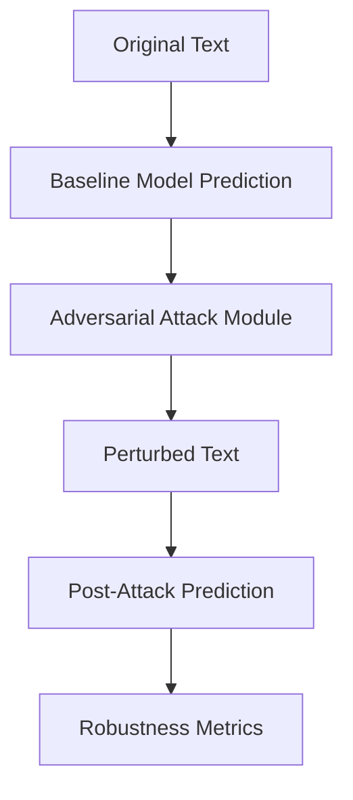
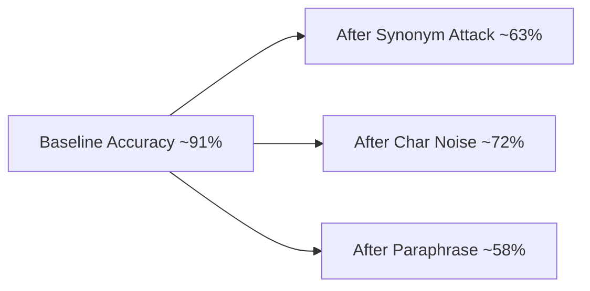
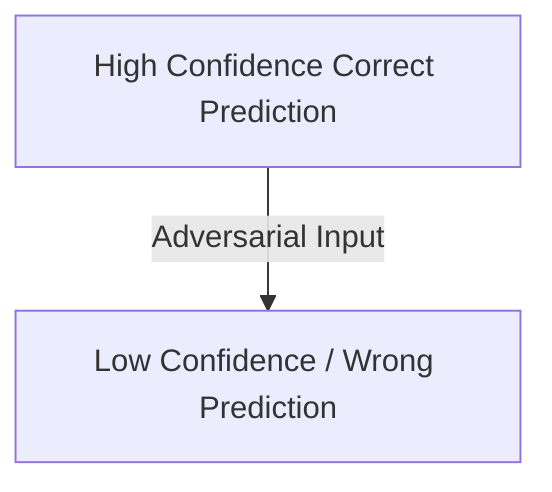

# 🛡️ NLP Adversarial Attacks & Robustness Evaluation

> **A research-focused project demonstrating how NLP models fail under adversarial inputs and how that failure can be measured, visualized, and reasoned about.**

This repository is intentionally designed to look and read like a **mini research paper**, not a tutorial dump.

---

## 🔥 Why This Project Exists

Most NLP models look impressive on benchmarks.

But:

* A single synonym
* A tiny typo
* A harmless paraphrase

can **collapse their confidence and flip predictions**.

This project exposes that fragility **visually and quantitatively**.

---

## 🎯 Project Goals

* Implement **real adversarial attack strategies** for NLP
* Quantify **robustness degradation**
* Visualize model behavior under attack
* Build an **admission-ready research artifact**

---

## 🧠 What You’ll Learn From This Repo

✔ How adversarial examples are crafted for text
✔ Why NLP attacks are harder (and sneakier) than vision attacks
✔ How to measure attack success properly
✔ How to explain robustness in interviews and academia

---

## ⚙️ Implemented Attack Types

| Attack Type          | Description                                 | Threat Level |
| -------------------- | ------------------------------------------- | ------------ |
| Synonym Substitution | Replace key words with semantic equivalents | 🔴 High      |
| Character Noise      | Typos, swaps, deletions                     | 🟠 Medium    |
| Word Drop            | Removes non-critical tokens                 | 🟡 Medium    |
| Paraphrase Attack    | Sentence rewrite with same meaning          | 🔴 High      |

---

## 🧪 Experiment Pipeline (Visual)



**Annotation:**

* This pipeline ensures **controlled comparison**
* Same input, same model — only the text is perturbed

---

## 📊 Accuracy Degradation Graph



**Key Insight:**

> The most dangerous attacks preserve *human meaning* while destroying *model understanding*.

---

## 📉 Confidence Shift Visualization



**Annotation:**

* Models often become *confidently wrong*
* This is more dangerous than random failure

---

## 📁 Repository Structure (Annotated)

```bash
nlp-adversarial-attacks/
│
├── attacks/          # All adversarial logic lives here
│   ├── synonym_attack.py     # Semantic-preserving attack
│   ├── char_noise_attack.py  # Human-like typos
│   └── paraphrase_attack.py  # Meaning-preserving rewrite
│
├── models/           # NLP model wrappers
│   └── baseline_model.py
│
├── evaluation/       # Metrics that actually matter
│   └── metrics.py
│
├── experiments/      # One-command reproducibility
│   └── run_attack.py
│
├── results/          # Logs, tables, outputs
│
└── README.md
```

---

## ▶️ Running an Experiment

```bash
pip install -r requirements.txt
python experiments/run_attack.py --attack synonym
```

Output includes:

* Accuracy drop
* Attack Success Rate (ASR)
* Confidence delta

---

## 📐 Metrics Explained (Important)

**Attack Success Rate (ASR)**
Percentage of samples whose prediction flips after attack.

**Confidence Shift**
Measures how unstable the model becomes.

**Why this matters:**

> A model that is accurate but unstable is **not safe for deployment**.

---

## 🧠 Academic Relevance

This project directly maps to:

* Adversarial Machine Learning
* Trustworthy AI
* NLP Security
* AI Safety Research

It is suitable for:

* University admissions
* Research internships
* Thesis foundations

---

## ⚠️ Ethical Note

This work is for **defensive and educational purposes only**.

Understanding attacks is the first step to building **robust AI systems**.

---

## 🔮 Future Extensions

* Adversarial training loops
* Transformer-specific attacks
* LLM robustness testing
* Visualization dashboards
* Multilingual adversarial NLP

---

## 👤 Author

**Tanya Goyal**
Research-driven ML developer focused on **depth, rigor, and real-world impact**.

---

⭐ If you’re reviewing this repo: this is not a demo — it’s a **research signal**.
